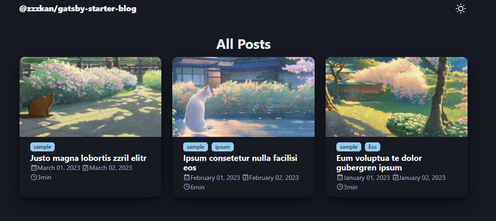

<h1 align="center">
  @zzzkan/gatsby-starter-blog
</h1>
<p align="center">
  <a href="https://github.com/zzzkan/gatsby-starter-blog/blob/main/LICENSE">
    
  </a>
  <a href="https://app.netlify.com/sites/zzzkan-gatsby-starter-blog/deploys">
    
  </a>
</p>



## Demo

<https://zzzkan-gatsby-starter-blog.netlify.app/>

## Features

- MDX
- [Chakra UI](https://github.com/chakra-ui/chakra-ui) theming
- Light mode / Dark mode
- Code highlighting with [Shiki](https://github.com/shikijs/shiki)
- Tags
- Related posts based on simple tag matching
- Psagination
- Social buttons (GitHub, Twitter, RSS)
- RSS Feed
- SEO

And also be sure to check out [@zzzkan/gatsby-theme-blog](https://github.com/zzzkan/gatsby-theme-blog/tree/main/package#readme) for more information.

## Getting Started

Use the Gatsby CLI to clone the site and install dependencies.

```sh
npx gatsby new gatsby-starter-blog https://github.com/zzzkan/gatsby-starter-blog
```

Or create your repository using this template on GitHub.

## Contact me

Thanks for your interest in my project. Don't hesitate to contact me via [Twitter](https://twitter.com/_zzzkan) if you need anything.
